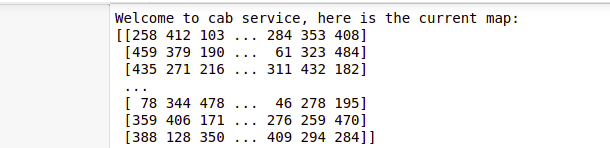
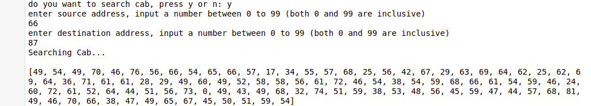

# Ride-Hailing-Demo-App

#### This is a map 
map is a matrix each cell has a value which represent weight of that cell,
if any user enter source and destination ,there will be some weight of source and destination ,according to that value i will calculate distance between source and 
destination

#### here user will enter their source and destination address  
Calculated distace between source and destination suing dikshtra algorithm
single source sottest path.and i will get the distance from user's source to destination
Then i took 4 nearest node from source  as driver using dikshtra algorithm

##### nearest driver accepted ride 
out of four nearest driver some driver may cancel,but any one may accept th ride 
for that first i pushed all four near driver in queue,then i generate a random value form 0 to 1 if  random value 
is zero means driver canceled ride and i will pop front of quue which means there are only 3 driver left for user .
if random value is 1 means driver accepted the ride ,then i will calculate time according to distance from user to driver.

