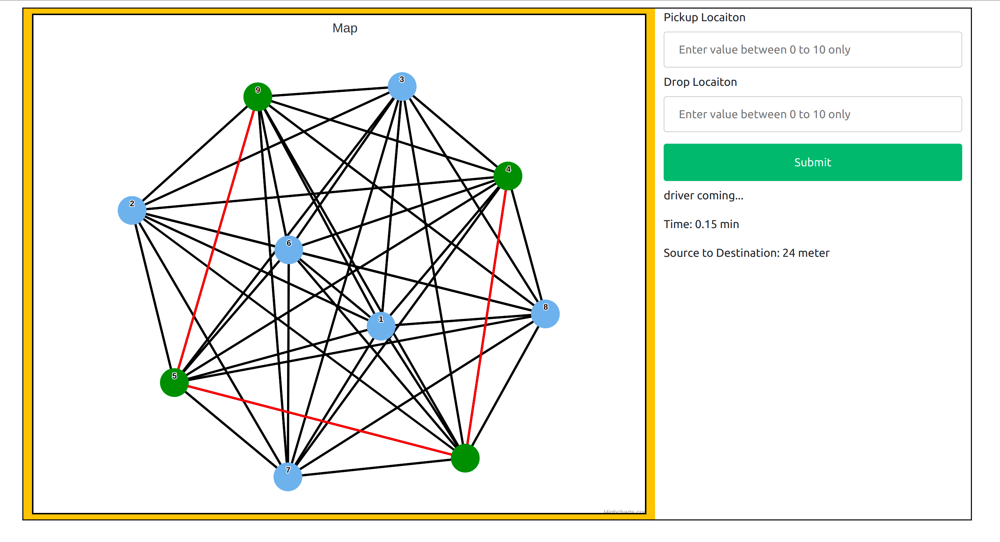

# Ride-Hailing-Demo-App

#### This is a map 

map is a grpah where a node is denoting a location.there is edge between two node denoting path from one node to onother node.a user can enter a node in Pickup Locaiton box and another node in drop location box and algorithm in backend will find sortest distance between source location to destination location using dikshtra algorithm  on backend same map is a graph as adjacency matrix  each cell(index i,j) has a value which represent distance between source i to destination j,but there may be sortest distance  between i to j which may be lesser then given in cell in graph. if any user enter source as (i) and destination as(j) ,it will pic value of matrix[i][j] which is distance from source to destination of user. all dignol value is zeor because in dignol allways source=destination(i=j),so if source and destination are equal then allways distance between source to destination will be zero.
graph is  symmetric about diagnol (because distance between source to destination) allways will be equal to (distance between destination to source). 

#### here user will enter their source and destination address 
##### In some area Ride-Hailing is not availble 
Service is not availble on whole earth. if user chose source or destination out of service range where Service is not availble then it wil show warning.
user can select only those area which are in given map.in given pic user entered source address out of range .

Here user intered destination out of range where service is not availble so it showing warning that destination address is not valid

User Has entered source and destination within range where service is availble so driver will be connected to user .now we have source to destination distance,we have to calculate sortest dustance and path from source to destination for that i hvae used dikhstra algorithm.after applying dikshtra algorithm we will have sortest distance in km or miter,i have generated a random value 'trafic' if there is value in trafic means there is trafic in path so will add that trafic in distance(to reach source to destination) according to distance we will calculate amount to pay for this ride and how much time will take to reach source to destination.

i will find nearest driver using dikshtra algorithm(i am not calling dikshtra algorithm again when i was calculating nearest path from source to destination, same time i will pck four nodes which is near to source)which is four near drivers

red edge representing sortest path from source to destination location
 
 
n

##### nearest driver accepted ride 
out of four nearest driver some driver may cancel,but any one may accept the ride 
for that first i pushed all four near driver in queue,then i generate a random value form 0 to 1 if  random value 
is zero means driver canceled ride and i will pop front of quue which means there are only 3 driver left for user .
if random value is 1 means driver accepted the ride ,then i will calculate time according to distance from user to driver to reach.

Ride hailing demo app

Ride hailing demo app is similar to uber,ola cab service. This project is a data structure based application.User can enter their source location and destination location,after that application will search for drivers near the user,distance between driver and user,how much time will be taken  to reach the driver and shortest distance between source and destination all this information will be displayed to the user(on front-end).

Elements
Back-end

On the back-end map is represented as an graph (adjacency matrix),matrix has value between 0 to 300.Each value in matrix represented as distance between two nodes.Each node in graph is represented as a location(address).The ith node is connected to the jth node if there is a value greater than 0 on graph[i][j].if there is value zero on graph[i][j] then ith node is not connected to jth node ,in another word there is no way to reach directly from source location i to destination location j and vice versa.In matrix(graph) diagonal value is zero because there is no mean to connect source node to source node or destination node to destination node.

backend graph 

When a user enters their source node and destination node,the user will be provided the shortest distance between source node to destination node.The shortest distance will be calculated using Dijkstra's algorithm.Dijkstra’s algorithm find single source shortest path,means shortest distance between source to all other nodes.Shortest distance will be calculated using dijkstra’s algorithm that will give us shortest distance between source node to all other nodes,out of all shortest distance we will take only source to destination distance.

There may be traffic on roads that will increase the time to reach the driver and increase distance(time increase means increase in distance)between source and destination.So we will create another matrix with name traffic of same size as graph,now before applying dijkstra algorithm traffic matrix will be added to the graph,means there is increment in distance on paths due to traffic.

Traffic matrix is a random generated value between 1 to 4,each value between 1 to 4 in the traffic matrix represents the amount of traffic on the particular edge .Diagonal cells are zero same as graph because there is no path, means no traffic.Normalization is performed on traffic matrix to make traffic’s value between 0 to 1 using using (traffic[i][j]-min)/(max-min), where max and min is smallest and largest value in the matrix. 

Some nodes from the graph will be taken as a drivers, whose distance is less than 5 units will be consider as drivers.During shortest distance calculation between source to all other nodes, Drivers will be taken those nodes whose distance from source to current node is less than 5 units.There may be lots of nodes whose distance will be less than 5 units,but i have taken only top 5 nodes whose distance is less than 5 units.To store top 5 driver with less value i have used priority queue,if there is already 5 nodes in priority queue and 6th node occured whose distance from source to destination is less then largest element in priority queue,then we will replace largest element in priority queue with 6th node.

Flask API: Flask is a web application framework written in Python. I used flask API to link the front-end with the back-end. The front end can send requests to the back-end to find the nearest driver.

Front-End
HTML, CSS, and JavaScript are used to design the front-end. On the front-end a graph is drawn from the back-end's graph using the Highcharts API.All nodes and weights of graphs are taken from the back-end’s graph.User can view nodes(locations) and distance between nodes.

Traffic will be represented on the front-end's graph, with three colors: red,green and yellow. The Red edge means there is lots of traffic,green edge  means there is less traffic,yellow means there is traffic but not too high and  not too low.These traffic color is map with normalized traffic matrix on back-end,we have discussed the value of normalized traffic matrix will be between 0 and 1.If traffic value is between 0 and 0.4 then edge color will be green,if traffic value is greater than 0.4 and and less than 0.7 then edge color will be yellow and if traffic value is greater than 0.7 to 1 then edge color will be red.

There are two input boxes, one for the pickup location of the user and another for drop location.User can enter source location as number between 0 to 9 and same for destination location because there is 10 nodes in the graph.After entering source and destination location the user can click on the submit button,a request will be sent from front end to back-end on Flask API with source location and destination location to find the nearest driver and shortest distance between source to destination.Flask API response with source to destination distance,time to reach driver,path from source to destination,normalized traffic-matrix to color front-end’s graph.Colors on the edge represents amount of traffic on edge.Red color in this graph(second image) is representing path from source address to destination address.

If a user enters an address where Ride-hailing service is not available then it will say invalid input.basically if user enter node greater than 9 or less than 0 then this input is ivalid,because there are only 10 nodes 0 to 9,it means ride-hailing service available in these area only.

