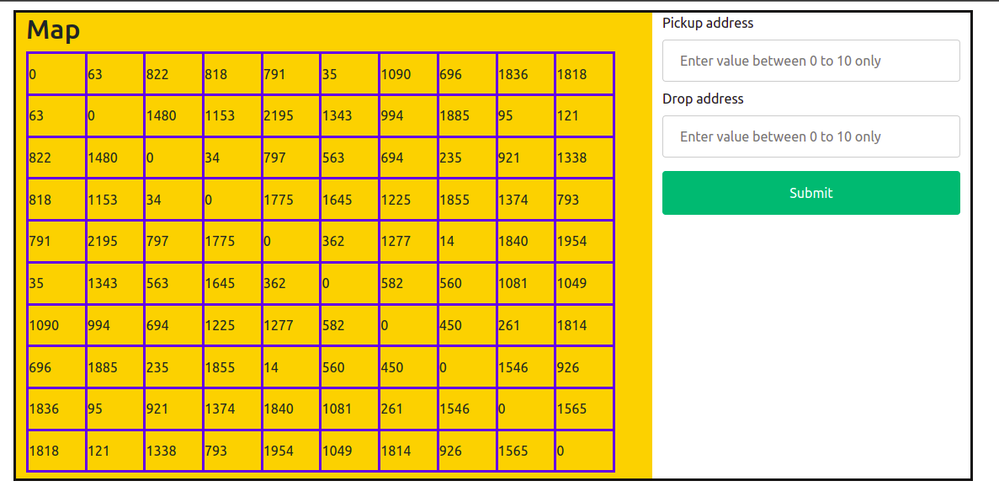

# Ride-Hailing-Demo-App

#### This is a map 

map is a grpah where a node is denoting a location.there is edge between two node denoting path from one node to onother node.a user can enter a node in Pickup Locaiton box and another node in drop location box and algorithm in backend will find sortest distance between source location to destination location using dikshtra algorithm  on backend same map is a graph as adjacency matrix  each cell(index i,j) has a value which represent distance between source i to destination j,but there may be sortest distance  between i to j which may be lesser then given in cell in graph. if any user enter source as (i) and destination as(j) ,it will pic value of matrix[i][j] which is distance from source to destination of user. all dignol value is zeor because in dignol allways source=destination(i=j),so if source and destination are equal then allways distance between source to destination will be zero.
graph is  symmetric about diagnol (because distance between source to destination) allways will be equal to (distance between destination to source). 

#### here user will enter their source and destination address 
##### In some area Ride-Hailing is not availble 
Service is not availble on whole earth. if user chose source or destination out of service range where Service is not availble then it wil show warning.
user can select only those area which are in given map.in given pic user entered source address out of range .

Here user intered destination out of range where service is not availble so it showing warning that destination address is not valid

User Has entered source and destination within range where service is availble so driver will be connected to user .now we have source to destination distance,we have to calculate sortest dustance and path from source to destination for that i hvae used dikhstra algorithm.after applying dikshtra algorithm we will have sortest distance in km or miter,i have generated a random value 'trafic' if there is value in trafic means there is trafic in path so will add that trafic in distance(to reach source to destination) according to distance we will calculate amount to pay for this ride and how much time will take to reach source to destination.

i will find nearest driver using dikshtra algorithm(i am not calling dikshtra algorithm again when i was calculating nearest path from source to destination, same time i will pck four nodes which is near to source)which is four near drivers

red edge representing sortest path from source to destination location
 
 
n

##### nearest driver accepted ride 
out of four nearest driver some driver may cancel,but any one may accept the ride 
for that first i pushed all four near driver in queue,then i generate a random value form 0 to 1 if  random value 
is zero means driver canceled ride and i will pop front of quue which means there are only 3 driver left for user .
if random value is 1 means driver accepted the ride ,then i will calculate time according to distance from user to driver to reach.

